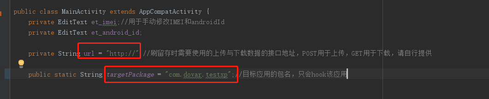
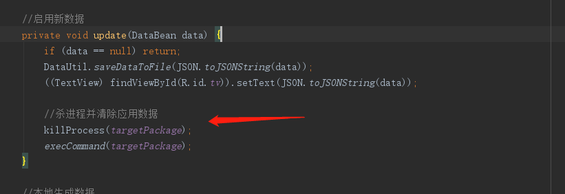

## 如何使用
修改下图中的targetPackage即可，开启刷留存功能需要后台接口支持，请自行提供。

## 已hook参数列表

        Build.Model
        Build.BOARD
        Build.BRAND
        Build.MANUFACTURER
        Build.ID
        Build.DEVICE
        Build.SERIAL
        Build.VERSION.SDK
        Build.VERSION.RELEASE
        imei
        android_id
        屏幕分辨率相关
        网络相关

你可以对本项目中Xposed相关逻辑进行修改，但一定要记住：要想让新的假数据生效，必须在设置数据后清除目标应用的所有数据，因为友盟会保存用户的唯一识别码在应用数据中。

